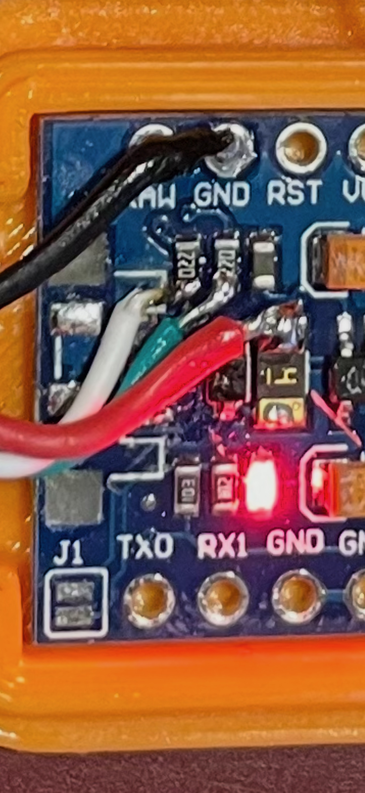

# ZoomShutter

## BOM

- [TowerPro SG90 Micro Servo](https://www.adafruit.com/product/169)
  - Note: SG92 is linked
- [12mm Tactile Button](https://www.adafruit.com/product/1119)
- [5mm LED](https://www.adafruit.com/product/4203)
- [150-220 ohm resistor](https://www.adafruit.com/product/2780)
- [Arduino Pro Micro](https://a.co/d/6WW093i)
- [Micro USB Breakout](https://a.co/d/8bGN940)

## Pinout

- Tactile Button
  - `GND` & `Pin 7`
- LED
  - Cathode to Resistor to `Pin 8`
  - Anode to `GND`
- Servo
  - Yellow (data) to `Pin 9`
  - Orange to `VCC`
  - Brown to `GND`
- Micro USB Breakout
  - `GND` to `GND`
  - `VBUS` to `Polyfuse` (if looking from the usb micro port, the left side of the fuse)
  - `D+` to the second diode (right side of diode) [green wire]
  - `D-` to the first diode (right side of diode) [white wire]
  - 
